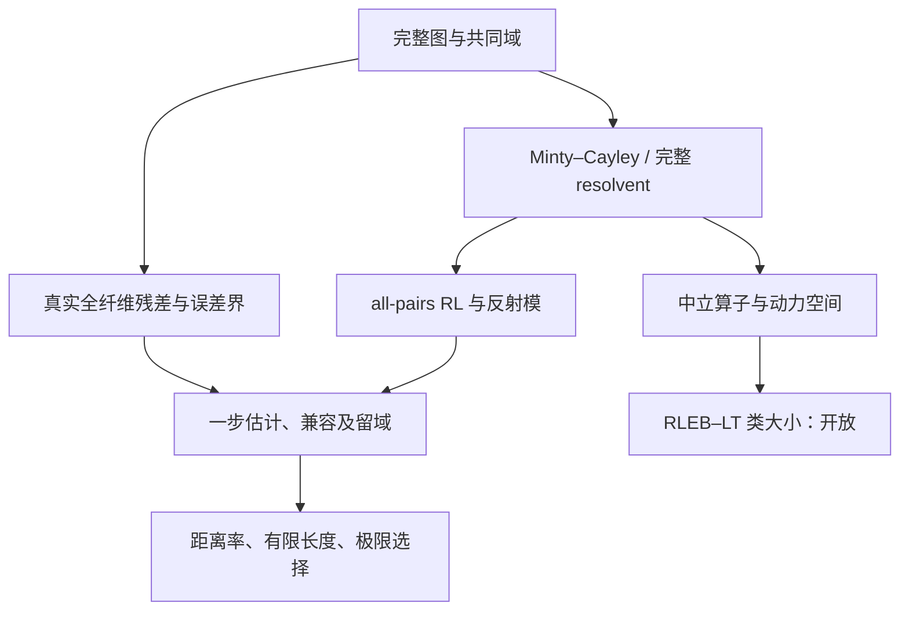

# PPA 数学研究地图

本仓库根据 2026-09-30 收到的「次单调论文研究.zip」初始化。目录中的原研究文本是数学论证的来源；本页是导航和状态索引，不是证明。初始导入保留原目录和文件名；[导入清单](INGEST_MANIFEST.tsv)给出逐文件 SHA-256、去向和未纳入原因。[原上传包校验值](UPLOADED_ARCHIVE.sha256)用于核对来源。没有把聊天总结当作证明，也没有因为某稿被称为“投稿稿”就把其原创性或正确性升级为外部确认。

## Research Goal

项目以广义单调性、真实误差界和近端点算法（PPA）为核心，形成三条可分开的研究目标：

1. **RLEB–PPA**：在明确的 range coverage、同一图块、真实残差和留域预算下，证明非线性反射控制加误差界足以使近端轨道收敛；识别多值接缝的真实增量和适用边界。
2. **算子空间比较**：在不以证书参数预先定义的自然对象空间中，比较 RLEB、Luke–Tam 公共 all-pairs 接口与极大单调类的覆盖规模。严格多出一个例子不解决“多大”这一问题。
3. **Hölder–RL 结构稿**：研究满足全图、全尺度 Hölder–RL 条件的关系能否被同一个强单调双 Lipschitz 映射同时近似正反纤维，以及有限维全纤维的精确可实现性；2026-09-25 候选 PDF 还提出独立的局部拓扑值域证书。

锥优化 CRSC/MSCQ、Markov/输运差异、解选择稳定性是独立或相邻主线。它们不能只凭主题相似就成为 RLEB 收敛定理的推论。

## Mathematical Objects 与 Definition Map

令 \(F:H\rightrightarrows H\)，\(\lambda>0\)，\(S=F^{-1}(0)\)，\(J_{\lambda F}(p)=\{x:p-x\in\lambda F(x)\}\)，\(r_F(x)=\inf_{v\in F(x)}\|v\|\)（空值为 \(+\infty\)）。对图点 \((x,v),(y,w)\) 写 \(d=(x-y)+\lambda(v-w)\)、\(e=(x-y)-\lambda(v-w)\)。**全图 all-pairs RL** 在声明的图块与尺度上是 \(\|e\|\le L\|d\|^\gamma\)；它不同于只与解点比较的 anchored 条件。Cayley 输入 \(p=x+\lambda v\) 上的 \(C(p)=x-\lambda v\) 把该式变为 Hölder 模，且 \(x=(p+C(p))/2\)、\(v=(p-C(p))/(2\lambda)\)。

RLEB 局部收敛另外要求：完整或明示限制的 resolvent 的 **coverage**；误差界 \(d(x,S)\le\psi(r_F(x))\) 在实际输出有效；\(\psi((t+Lt^\gamma)/(2\lambda))\le\kappa t\)；使整条轨道留在共同图块的初始长度预算。**全局图 maximal at fixed parameters** 则是另一概念：给定 \(\lambda,L,\gamma\) 时图在该不等式下不可真扩张，既非极大单调，也不等于局部 coverage。9/23 结构稿取 \(H\) 为实 Hilbert 空间、\(L>0\)、\(0<\gamma<1\)、全图全尺度条件；其有限纤维分类另外取 \(H=\mathbb R^n\) 和图极大。

算子空间主线首阶段取 \(E=\mathbb R^d\)，用完整闭图 \(G=\operatorname{gph}F\) 和固定步长图剪切 \((u,v)\mapsto(u+\lambda v,u)\)。**全域完整** \(T=J_{\lambda F}\) 可恢复 \(F(u)=\{(p-u)/\lambda:Tp=u\}\)，局部 \(T|_U\) 一般不可恢复域外图和真实最小残差。比较单位 \(F\)、\((F,\lambda)\)、轨道／步长策略及选择量词必须分别声明。具体约定以 [RLEB 定理骨架（ZIP 内）](assets/次单调论文研究/分类集研究/RLEB_LT_operator_space_research_asset_v1/RLEB_LT_operator_space_research_asset_v1/06_RELATED_MANUSCRIPT_ASSETS/source_inputs/RLEB_PPA_submission_assets_2026-09-18.zip)、[中立体系蓝图](assets/次单调论文研究/分类集研究/RLEB_LT_operator_space_research_asset_v1/RLEB_LT_operator_space_research_asset_v1/02_NEUTRAL_PPA_SYSTEM/ppa_system_team/10_final_blueprint.md) 和 [结构稿 TeX](assets/次单调论文研究/最新成果/Holder_RL_Formal_Manuscript.tex) 为准。

## Claim Map 与 Known Results

完整量词、状态、证据和异议在 [CLAIMS.md](CLAIMS.md)。下面的箭头仅表示**所列范围内**的依赖，不能跨稿迁移。

| 编号 | 命题身份与依赖 | 当前证据层 |
| --- | --- | --- |
| C01 | 全图 RL ↔ Cayley Hölder 图坐标；基础代数引理 | 稿内证明，可直接复核 |
| C02 | 9/18 局部 RLEB：coverage + RL + 真实 EB + 兼容 + 留域 → 收敛与尾界 | 原稿证明与内审记录；本轮未重审全部条件 |
| C03 | 9/23 全局 RL → 一个同时近似正反纤维的强单调影子，统一因子 \(1/\sqrt2\) | 有 TeX 证明的研究稿候选，尚待独立深审 |
| C04 | 有限维图极大 RL 的完整逆纤维恰为非空、紧、直径 \(\le L^{1/(1-\gamma)}\) 的集合 | 同一研究稿候选；依赖 C01、全域扩张和不动点构造 |
| C05 | 9/25 PDF 的局部有限 proximal 数据 + 额外拓扑假设 → 原关系值域邻域 | 独立假设层的新增候选；缺对应 TeX 和独立核验 |
| C06 | 紧源 T-only 图卡中实际尾／反射模观测的 properness 与紧纤维 | 9/20 内部独立审计，严限于该图卡 |
| C07 | 9/21 提纯包报告的普通 Baire／原动力度量多孔性塌缩 | V-A/V-B 历史总账；部分原证明在本次附件中缺失 |
| C08 | 解选择映射的一般模传递与显式坏 Hölder 例 | 修订包报告修补后通过；一般定理只用于局部 \(J_{\mathcal G}\) 或另证完整纤维一致性 |

## Research Frontier 与 Open Problems

**体系级主瓶颈**：找自然、参数中立且保留完整原图和真实残差的空间／表示，以及有鉴别力的大小不变量，使 RLEB、LT、极大单调在同一接口上接受真正的规模比较。9/20 包中的 \(\Phi=(\text{actual tail},\text{actual reflector modulus})\) 在固定紧 T-only 图卡是 proper；它的 category-preserving 性与局部观测到完整 \(F\) 的提升仍缺。9/21 包进一步报告若干旧 Baire／多孔性环境**同时**把两个类判小，因而旧“差集非 \(\sigma\)-upper-porous”目标已被报告为假。需先恢复其未附原证明，再在新空间上提出可判真伪的比较命题。

结构稿的下一步是逐条攻击正反纤维的统一常数、Hilbert 空间 Hölder 扩张的使用条件、有限维固定点构造与值域覆盖；9/25 新增的 Čech／Vietoris–Begle／Lefschetz 引用须核对适用条件、完整 \(T\) 的独立假设及有限数据能验证哪些不等式。候选稿没有经本次独立同行审查。9/18 RLEB 投稿主张还需同对象同量词的先行性核查；锥、Markov 与结构稿各自的原创性也单独判断。

## Refuted / Failed 与 Next Actions

[FAILED_ROUTES.md](FAILED_ROUTES.md)记录每条路线具体的失败机制和可回收资产。优先行动：

1. 为 9/25 PDF 保存匹配的可编译源与版本差异；独立检查新增 Theorem 8.1 的拓扑定理调用和数值证书边界。
2. 从 9/21 提纯包的内部索引恢复 N05、N10 及内禀模谱原证明／审计，再确定哪些负结果可在新仓库升为有原件的 canonical record。
3. 对算子空间主问题先给中立空间、完整图恢复、大小不变量及反塌缩测试的一个精确命题；不得再把特殊层差距上推到母空间。
4. 按确切定理和版本完成 RLEB、锥、Markov 及结构稿各自的文献核验；外部文献事实不能仅凭内部摘要升级。

## File Map 与分批阅读

本轮按原目录的总目录、分类集、最新成果、正式后的研究、相似研究，以及嵌套 9/14 与 9/21 包的入口和关键证明，完成**初始化阅读**。这是来源、定义、范围和冲突的审计，不是对每一页证明或每篇外文论文的重新审稿。[BATCH_README.md](BATCH_README.md)列出各批阅读范围及未核实项。路径均相对仓库根，链接可直达。

| 路径 | 内容、数学作用、何时读 |
| --- | --- |
| [RESEARCH_STATE.md](RESEARCH_STATE.md) | 当前活跃目标、版本优先级、关键 proof obligations；开始新任务先读。 |
| [CLAIMS.md](CLAIMS.md) | C01–C08 的精确身份、量词、依赖、证据与异议；引用重要命题前读。 |
| [FAILED_ROUTES.md](FAILED_ROUTES.md) | 旧量尺的共同塌缩、局部图信息损失、解选择稿的完整 resolvent 误用；拟重启路线前读。 |
| [assets/次单调论文研究/最新成果/](assets/次单调论文研究/最新成果/) | 9/23 结构稿 TeX/PDF、中文讲稿和 9/25 增补 PDF；研究影子、纤维或局部值域时读。9/25 PDF 比 TeX 多 §8，不可视为同版源码。 |
| [assets/次单调论文研究/分类集研究/RLEB_LT_operator_space_research_asset_v1/RLEB_LT_operator_space_research_asset_v1/](assets/次单调论文研究/分类集研究/RLEB_LT_operator_space_research_asset_v1/RLEB_LT_operator_space_research_asset_v1/) | 9/20 完整分类集技术包：`00_START_HERE`→`STATUS`→`OPEN_PROBLEM`→`01_CANONICAL_HANDOFF/.../07_final_handoff.md` 与 `06_math_audit.md`；含全图、\(\Phi\)、LT 嵌入、分母与文献边界。阅读时保留包内 CANONICAL/HISTORICAL/SUPERSEDED 标签。 |
| [assets/提纯总账_2026-09-21_v0.9/](assets/提纯总账_2026-09-21_v0.9/) | 9/21 后续总账：`01_CURRENT_MAP`、`02_VERIFIED_CORE`、`03_NO_GO_LEDGER`、`04_OPEN_GATES`；可先了解更晚的负结果，但 V-B/SOURCE-MISSING 不能替代原证明。 |
| [assets/次单调论文研究/正式后的研究/](assets/次单调论文研究/正式后的研究/) | 9/18 解选择 `research_note.md`、独立证伪任务及实验 ZIP；需结合分类集 `06_RELATED_MANUSCRIPT_ASSETS/solution_selection_revised_v1_delivery.zip` 的修订审计，不能只用旧稿。 |
| [assets/次单调论文研究/RL_foundations.md](assets/次单调论文研究/RL_foundations.md) | Hilbert 空间 RL 量词、全／限制关系、覆盖／排除／不变、PPA gauge 定理与例子；追溯早期定义时读，其旧战略不覆盖较新状态。 |
| [assets/次单调论文研究/ATTACK_PRODUCT_CONE_CRSC_MSCQ.md](assets/次单调论文研究/ATTACK_PRODUCT_CONE_CRSC_MSCQ.md) 与 [MARKOV_PAPER_THEOREM_PACKAGE.md](assets/次单调论文研究/MARKOV_PAPER_THEOREM_PACKAGE.md) | 两条独立旁支的证明包、边界和优先权门；只有研究锥或随机输运时进入，不自动并入 RL 定理。 |
| [assets/历史总包_2026-09-14/](assets/历史总包_2026-09-14/) | 原嵌套 9/14 总包逐文件展开的来源谱系、数学稿、审计和超边导航；用于追溯历史。第三方原文 PDF 未公开复制。 |
| [INGEST_MANIFEST.tsv](INGEST_MANIFEST.tsv) | 原外层压缩包及 9/14、9/21 内部逐项 SHA-256、导入位置和排除原因；恢复／比对版本时读。 |

外部论文仅记录在原研究笔记和导入清单，不把带有个人使用或再分发限制的 PDF 推送到公开仓库。仓库中的原件不因目录迁移而改写，研究地图对它们的认识随核查更新。
